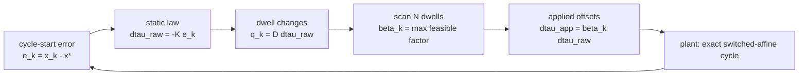

# Study guide: dwell-conditioned cycle-to-cycle switching-time feedback

A section-by-section companion to `article.tex`. Each entry gives the job of the section, the
result it produces, the equations worth memorizing, and the questions a reader or reviewer will
ask. Symbols follow `CONTEXT.md`.

## The paper in one page

A converter repeats a fixed sequence of $N$ affine modes every $T$ seconds. A static feedback law
watches the error at the start of each cycle and asks for small displacements of the interior
switching instants of the next cycle. Nothing else moves: not the mode order, not the number of
intervals, not the period.

The problem is that the law does not know about the minimum dwell duration. From a large error it
can request offsets that shorten an interval to zero or below, which is physically impossible.

The fix is one number. Multiply the whole requested vector by the largest $\beta \in [0,1]$ that
keeps every dwell admissible. Because one scalar scales the whole vector, the requested direction
survives, the period survives, and finding $\beta$ costs a single pass over $N$ numbers.

The payoff is that conditioning cannot produce an arbitrary gain. In the linearized model it
always lands on the segment $A(\beta) = (1-\beta)\Phi + \beta A_{\mathrm{cl}}$, so one quadratic
Lyapunov function that contracts the two endpoints certifies every possible conditioning sequence.

## Section 1: introduction

**Job.** Get the reader from "converters have timing constraints" to "a static law needs a
feasibility layer" in four paragraphs, without a literature survey.

**The four layers.**

1. *Pressure.* Converter controllers face a fixed switching frequency, a minimum duration per
   switch configuration, and current and voltage bounds, all decided within one short interval.
   Predictive control enforces these explicitly and pays for an online solver. Recent work attacks
   that cost (Laguerre parameterization, fixed-frequency solvers, candidate pruning). Static
   feedback removes the solver but not the constraints.
2. *Setting.* Fixed mode sequence, fixed period, one static correction per cycle to the interior
   instants only. The target is a periodic trajectory, not an equilibrium. This is a different
   actuator from state-dependent mode selection and from online schedule optimization.
3. *Prior work and the gap.* Patiño et al. give the mode-dependent switching sensitivity.
   Marcolino et al. give fixed-period coordinates, the one-cycle model, dwell-constrained MPC, and
   a static LQR. Their constrained MPC respects the dwell limits; their standalone LQR needs
   saturation applied instant by instant, which can move the final switching instant, and the
   reported response diverges. Generalizing: each dwell depends on two adjacent offsets, so an
   unconstrained action can violate the limits, and clipping offsets one at a time changes the
   direction the law asked for.
4. *Contribution.* The maximal direction-preserving scalar conditioner, and the common-quadratic
   certificate for the resulting matrix segment. Everything else is support.

**Remember the novelty boundary.** Switching sensitivity, fixed-period coordinates, one-cycle
feedback, and LQR are all prior art. The two new things are the conditioner and its certificate.

## Section 2: fixed-period one-cycle model

**Job.** Produce two things the conditioner needs: how an offset changes the next cycle-start
error, and what dwell durations that offset produces. Four steps.

### Step 1, timing coordinates (Sec. 2.1)

The plant is $\dot{x} = A_{\sigma(t)} x + b_{\sigma(t)}$, with the cycle following a fixed mode
sequence $\Omega = (\omega_1, \dots, \omega_N)$ between nominal boundaries
$0 = \bar t_0 < \cdots < \bar t_N = T$ and nominal dwells $\bar d_i = \bar t_i - \bar t_{i-1}$.

The reference periodic trajectory $\bar x(t)$ has cycle anchor $x^\star = \bar x(0) = \bar x(T)$,
which is a fixed point of the nominal one-cycle map. The error is $e_k = x_k - x^\star$.

Only the $N-1$ interior instants move, $t_{k,i} = \bar t_i + \delta\tau_{k,i}$, with
$\delta\tau_{k,0} = \delta\tau_{k,N} = 0$. The dwell changes follow from the difference matrix:

$$\delta d_k = D\,\delta\tau_k, \qquad \delta d_{k,i} = \delta\tau_{k,i} - \delta\tau_{k,i-1}$$

**The one identity to memorize.** $\mathbf{1}^{\mathsf T} D = 0$. Moving an instant later lengthens
the interval before it and shortens the interval after it by the same amount, so the dwell changes
sum to zero and *every* offset vector preserves $T$. This is why the period is never at risk, and
why scaling by $\beta$ cannot break it either.

**Why two coordinate systems.** $\delta\tau$ is what the controller commands and it has $N-1$ free
entries. $\delta d$ is what the constraint is written in and it has $N$ entries, one per interval.
$D$ is the bridge, and it is the reason the constraints couple: dwell $i$ depends on offsets $i$
and $i-1$.

### Step 2, exact augmented propagation (Sec. 2.2)

Affine flows do not compose as a product of transition matrices, because each interval carries its
own forced term $b_{\omega_i}$. Appending a constant coordinate fixes this:

$$\mathcal X = \begin{bmatrix} x \\ 1\end{bmatrix}, \quad
F_i = \begin{bmatrix} A_{\omega_i} & b_{\omega_i} \\ 0^{\mathsf T} & 0 \end{bmatrix}, \quad
\Pi = \begin{bmatrix} I_n & 0 \end{bmatrix}$$

On interval $i$ the augmented dynamics are linear, $\dot{\mathcal X} = F_i \mathcal X$, so with
$E_i(s) = e^{F_i s}$ and $\phi_i = E_i(\bar d_i)$ one cycle is an ordered product of exponentials
of the *actual* durations. This is exact. No approximation has entered yet, and this exact map is
what the simulation in Sec. 4 uses.

### Step 3, first-order expansion (Sec. 2.3)

Only the durations vary, and each enters through one exponential, so
$E_i(\bar d_i + \delta d_{k,i}) = \phi_i + F_i \phi_i \, \delta d_{k,i} + O(\delta d^2)$.

Substituting into the ordered product and keeping at most one perturbation per term:

- the nominal product $\widetilde\Phi = \phi_N \cdots \phi_1$ cancels against the nominal cycle,
  because periodicity gives $\widetilde\Phi \bar{\mathcal X}_0 = \bar{\mathcal X}_0$;
- terms $\delta d_{k,i} \tilde e_k$ pair an error with a dwell change and are second order, so they
  are dropped. **This is the only place the linearization loses something**, and it is why the
  nonlinear guarantee later is local;
- what remains is $e_{k+1} = \Phi e_k + G_d \, \delta d_k$ after projecting with $\Pi$, where
  $\Phi = e^{A_{\omega_N} \bar d_N} \cdots e^{A_{\omega_1} \bar d_1}$ and the columns of $G_d$ come
  from $\tilde g_i = \phi_N \cdots \phi_{i+1} F_i \bar{\mathcal X}_i$.

### Step 4, back to switching instants (Sec. 2.4)

Substituting $\delta d = D \, \delta\tau$ gives the model actually used:

$$e_{k+1} = \Phi e_k + \Gamma_\tau \, \delta\tau_k, \qquad \Gamma_\tau = G_d D$$

Column $i$ is $\Gamma_{\tau,i} = \Pi(\tilde g_i - \tilde g_{i+1})$, and factoring the adjacent terms
gives the interpretable form:

$$\Gamma_{\tau,i} = e^{A_{\omega_N}\bar d_N}\cdots e^{A_{\omega_{i+1}}\bar d_{i+1}}
\Big[(A_{\omega_i} - A_{\omega_{i+1}})\bar x(\bar t_i) + b_{\omega_i} - b_{\omega_{i+1}}\Big]$$

**Read this out loud.** The bracket is the jump in the vector field at the switching state.
Displacing instant $i$ trades time between two adjacent modes without changing the state there to
first order, and the remaining nominal transitions carry that jump to the end of the cycle. This
is exactly the switching-sensitivity structure Patiño reported, reached here from dwell
perturbations in fixed-period coordinates.

**The special case.** If every interval shares $A_{\omega_i} = A_c$ and $b_{\omega_i} = B_c u_{i-1}$,
then $\Phi = e^{A_c T}$ and $\Gamma_{\tau,i} = e^{A_c(T - \bar t_i)} B_c (u_{i-1} - u_i)$, which is
Marcolino's switched-actuator model up to a sign convention. The converter in Sec. 4 does *not*
satisfy this, since its $A_u$ depends on the switch state. That is the concrete reason the
mode-dependent derivation is needed.

## Section 3: solver-free dwell-time conditioning

**Job.** Section 2 says what an offset does, not whether it can be applied. This section supplies
the feasibility layer and proves the closed loop contracts.

### The setup

Raw law and raw closed loop:

$$\delta\tau^{\mathrm{raw}}_k = -K e_k, \qquad A_{\mathrm{cl}} = \Phi - \Gamma_\tau K$$

Strict nominal margin, the standing assumption: $m = \bar d - d_{\min}\mathbf{1} > 0$. Each $m_i$
is how much dwell $i$ can be shortened before it becomes inadmissible.

Raw-action admissible region, a polyhedron in error space:
$\mathcal C = \{e : \bar d - DKe \ge d_{\min}\mathbf{1}\}$. Inside it, nothing happens.

### The conditioner

With $q_k = D \delta\tau^{\mathrm{raw}}_k$ the requested dwell changes,

$$\beta_k = \min\left\{1, \ \min_{i \,:\, q_{k,i} < 0} \frac{m_i}{-q_{k,i}}\right\},
\qquad \delta\tau^{\mathrm{app}}_k = \beta_k \, \delta\tau^{\mathrm{raw}}_k$$

with $\min \emptyset = +\infty$. Only the intervals being *shortened* can bind. The one that runs
out of margin first sets $\beta$.

**Proposition 1 (feasibility and maximality).** The proof is three lines and worth being able to
reproduce. If $q_{k,i} \ge 0$, scaling cannot shorten dwell $i$, so it imposes no bound. If
$q_{k,i} < 0$, admissibility requires $\beta \le m_i / (-q_{k,i})$. Intersect all such bounds with
$[0,1]$ and you get exactly the formula, so it is both feasible and the largest feasible choice.
Period preservation comes from $\mathbf{1}^{\mathsf T}D = 0$; direction preservation comes from
multiplying the *full* vector by one nonnegative scalar; the $O(N)$ cost is one pass over the
dwell changes.

**Why direction matters.** Clipping offsets individually also yields a feasible schedule, but the
applied vector then points somewhere the designer never chose, and its stability says nothing
about $K$. Scaling keeps the applied action on the ray the law asked for.

### The certificate

Applying $\delta\tau^{\mathrm{app}}$ in the linearized model gives $e_{k+1} = A(\beta_k) e_k$ with

$$A(\beta) = (1-\beta)\Phi + \beta A_{\mathrm{cl}}$$

**This is the structural payoff.** Conditioning cannot produce an arbitrary saturated gain. It can
only move along the segment between $\Phi$ (at $\beta = 0$, correction off) and $A_{\mathrm{cl}}$
(at $\beta = 1$, correction in full).

**Proposition 2 (common-Lyapunov contraction).** If some $P = P^{\mathsf T} > 0$ gives
$\|\Phi\|_P \le q_0 < 1$ and $\|A_{\mathrm{cl}}\|_P \le q_1 < 1$, then by the triangle inequality
for induced norms

$$\|A(\beta)\|_P \le (1-\beta) q_0 + \beta q_1 \le \max(q_0, q_1) < 1$$

for every $\beta \in [0,1]$. So $\|e_k\|_P \le q^k \|e_0\|_P$ for *any* sequence $\{\beta_k\}$,
including the state-dependent one the conditioner actually generates. No dwell-time argument, no
average-dwell-time argument, no switching-sequence assumption is needed. The $P$ comes from an
offline SDP; online the controller evaluates a matrix-vector product, $D\delta\tau^{\mathrm{raw}}$,
and a scalar scan.

**Note the requirement.** $q_0 < 1$ means the *open-loop* cycle map must already be contracting.
That holds on this benchmark ($\rho(\Phi) = 0.999850$) but it is a real assumption, not a free one.

### The nonlinear statement, and its limit

Assume $\mathcal P$ is $C^1$ while the mode order holds and $A_{\mathrm{cl}}$ is Schur. Since the
nominal margin is strict and $\delta\tau^{\mathrm{raw}}(0) = 0$, a neighborhood of the anchor lies
inside $\mathcal C$. There the conditioner never acts, $\beta = 1$, and the Jacobian of the exact
closed-loop map is $A_{\mathrm{cl}}$, giving local exponential stability of the anchor and its
phase-locked reference trajectory.

Beyond that neighborhood, Proposition 2 still covers arbitrary conditioning, **but only for the
linearized model**. It does not bound the nonlinear remainder, so it is not a global result. Keep
this distinction sharp; it is the most likely reviewer attack.

## Section 4: converter case study

**Job.** Answer three questions. Does the derived model reproduce the exact plant? Does the
certificate hold for a concrete design? Does conditioning buy anything an already-feasible
controller cannot deliver?

### The benchmark (Sec. 4.1)

Three-cell multilevel DC-DC converter from Patiño et al., state $x = [v_{C_1}, v_{C_2}, i_L]^{\mathsf T}$,
$E = 30$ V, $C_1 = C_2 = 40$ µF, $L = 10$ mH, $R = 10$ Ω. Both $A_u$ and $b_u$ depend on the switch
state, so the Marcolino specialization does not apply.

| Item | Value |
|---|---|
| Physical mode sequence | $(0,1,3,7,2,0,4,7,4)$, $N = 9$ |
| Cycle period $T$ | 286 µs |
| Reported anchor | $(9.9247, 19.2928, 0.9823)^{\mathsf T}$ |
| Nominal-design dwell bound $d_{\mathrm{bench}}$ | 22 µs |
| Applied-schedule dwell bound $d_{\min}$ | 3 µs (assumed) |
| Normalization | $S_x = \mathrm{diag}(10,20,1)$, $t_s = 10$ µs |
| Aggressive LQR | $Q_n = I_3$, $R_n = 0.001 I_8$ |
| Conservative LQR | $Q_n = I_3$, $R_n = 0.1 I_8$ |

**Schedule reconciliation, and what it is not.** The published boundaries are rounded to whole
microseconds, so exact propagation through them does not close the cycle back onto the anchor. The
dwell vector is adjusted once by least squares, holding the 286 µs period, the reported anchor, and
the 22 µs design bound. Largest boundary correction 2.111 µs, closure error $1.421\times10^{-14}$.
This prepares benchmark data. It is not a trajectory-design method, and it is not a contribution.

**Two dwell bounds, do not confuse them.** 22 µs is Patiño's nominal *design* constraint on the
reference schedule. 3 µs is a separate assumed bound on what the *controller* may command. Only
the second one drives $\beta$.

### Model checks (Sec. 4.2)

| Check | Result |
|---|---|
| Relative error, $\Phi$ vs central differences | $8.518\times10^{-12}$ |
| Relative error, $\Gamma_\tau$ vs central differences | $8.344\times10^{-11}$ |
| Linearization residual slope | 2.000 |

The relative errors sit at numerical noise. The slope of 2 is the point: a residual decaying as
$\epsilon^2$ is exactly what a correct *first-order* model must show. A slope near 1 would mean the
Jacobians were wrong.

**Certificate.** An offline SDP returns a common $P$ with $\|\Phi\|_P = 0.999939$ and
$\|A_{\mathrm{cl}}\|_P = 0.979743$, so the whole conditioned family contracts with bound 0.999939.
The bound is set by the open-loop endpoint, the slower of the two. That is honest but weak: it
certifies stability, not speed. The observed speed comes from $\beta$ being near 1 most of the time.

### Large-error simulation (Sec. 4.3)

From $x_0 = [7.5143, 20.8211, 0.0314]^{\mathsf T}$, normalized initial error 0.983946, far outside
the range used to validate the linearization. Every interval is propagated with exact matrix
exponentials; the linearized model is never used in the simulation. 100 cycles, extended to
100000 for the open-loop comparison.

| Quantity | Conditioned aggressive | Conservative | Open loop |
|---|---|---|---|
| Spectral radius | 0.568151 | 0.941468 | 0.999850 |
| Minimum dwell requested | −43.045 µs | 15.502 µs | n/a |
| Minimum dwell applied | 3.000 µs | 15.502 µs | n/a |
| Maximum offset raw / applied | 65.217 / 19.172 µs | feasible | n/a |
| Settling cycle ($\|S_x^{-1}e_k\| < 0.01$) | 6 | 20 | 22009 |
| Final error at cycle 100 | $1.7\times10^{-15}$ | $3.1\times10^{-6}$ | 0.298 |

**The headline numbers.** The raw aggressive law asks for a −43.045 µs dwell, which would invert
an interval and put two cycle boundaries out of order. The conditioner acts on 3 of 100 cycles,
bottoming out at $\beta_{\min} = 0.293978$. The minimum applied dwell is exactly 3.000 µs, which is
maximality doing its job: the binding constraint is met with equality, never with slack.

**The honest comparison.** The conservative law never needed conditioning, and it is the fair
opponent. The conditioned aggressive law still settles at cycle 6 against its cycle 20. So the
conditioner is not just a safety device; it lets you keep an aggressive gain you would otherwise
have to discard.

**The open-loop trap.** Over 100 cycles the open-loop response looks divergent in state space. It
is not. $\rho(\Phi) = 0.999850 < 1$, so it converges, just extremely slowly, staying above the 0.01
threshold until cycle 22009. Saying this explicitly protects the paper from an easy objection.

## Section 5: discussion

Three points, one per paragraph.

1. *What the conditioner is and is not.* It keeps the largest feasible scalar multiple and changes
   neither direction nor cycle boundaries. That is also its limit: it cannot look ahead, and it
   cannot pick a different direction when the requested one is nearly blocked. It does not replace
   constrained optimization for controllers that need either.
2. *Relation to prior work.* Patiño supplies the mode-dependent sensitivity, Marcolino the
   fixed-period coordinates, dwell inequalities, and LQR. The derivation connects them and is
   checked numerically. The new control result is the conditioner and the certificate, not the LQR.
3. *Limitations.* The 3 µs bound is a simulation assumption, not a hardware figure. Absent: timer
   quantization, delays, dead time, implementation margin, state estimation, model uncertainty,
   experiments. Fixed: mode order, phase, period. The exact nonlinear guarantee holds only where
   conditioning never acts.

## Section 6: conclusion

Restates the two contributions, the supporting derivation and checks, the benchmark outcome, and
the two open items: the local nonlinear guarantee, and hardware testing.

## Self-check questions

Work through these without the paper open.

1. Why does every switching-instant offset vector preserve the cycle period, whatever the
   controller asks for?
2. Why is the augmented coordinate needed at all? What breaks without it?
3. Where exactly does the linearization lose information, and how does that show up later as a
   limitation?
4. Give the physical reading of $\Gamma_{\tau,i}$ in one sentence.
5. Why does clipping each offset separately fail, even though the resulting schedule is feasible?
6. Reproduce the proof of Proposition 1.
7. Why is $A(\beta)$ a segment and not an arbitrary matrix, and why does that matter so much for
   the stability argument?
8. Proposition 2 needs $\|\Phi\|_P < 1$. What does that assume about the plant, and what would you
   do if it failed?
9. Why is the certified contraction bound 0.999939 when the aggressive closed loop has spectral
   radius 0.568151? Is the bound wrong?
10. Why is a residual slope of 2.000 the right answer, and what would a slope of 1 have meant?
11. Why is the minimum applied dwell exactly 3.000 µs and not, say, 3.4 µs?
12. Someone claims the open-loop response in the figure diverges. How do you answer?
13. State precisely what is proved, what is verified numerically, and what is only simulation
    evidence.

## Reference map

| Where to look | File |
|---|---|
| Paper source | `article.tex` |
| Terminology, one name per concept | `CONTEXT.md` |
| Goal, success criteria, accepted limitations | `GOAL.md` |
| Prior-art boundary and defensible claims | `research/novelty-review.md` |
| Reviewed literature 2021 to 2026 | `research/recent-literature-2021-2026.md` |
| Comparison against Marcolino's propagation | `research/marcolino-propagation-comparison.md` |
| Generated numbers used in the text | `results/metrics.tex` |
| Introduction funnel and citation strategy | `handoff/handoff-3-specialization-funnel-and-citation-integration.md` |
| Writing strategy for the prose pass | `handoff/handoff-4-scientific-writing-and-readability.md` |
