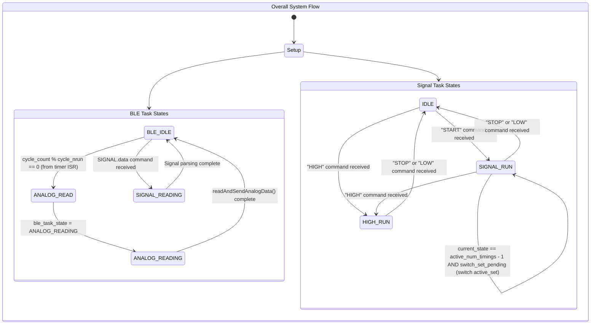

```mermaid

    stateDiagram
        direction LR
        state "Overall System Flow" as Overall_Flow {
            [*] --> Setup
            Setup --> BLE_States
            Setup --> Signal_States
        }

    state "BLE Task States" as BLE_States {

        BLE_IDLE --> ANALOG_READ : cycle_count % cycle_nrun == 0 (from timer ISR)
        ANALOG_READ --> ANALOG_READING : ble_task_state = ANALOG_READING
        ANALOG_READING --> BLE_IDLE : readAndSendAnalogData() complete
        BLE_IDLE --> SIGNAL_READING : SIGNAL.data command received
        SIGNAL_READING --> BLE_IDLE : Signal parsing complete
    }

    state "Signal Task States" as Signal_States {
        IDLE --> SIGNAL_RUN : "START" command received
        IDLE --> HIGH_RUN : "HIGH" command received
        HIGH_RUN --> IDLE : "STOP" or "LOW" command received
        SIGNAL_RUN --> IDLE : "STOP" or "LOW" command received
        SIGNAL_RUN --> HIGH_RUN : "HIGH" command received

        SIGNAL_RUN --> SIGNAL_RUN : current_state == active_num_timings - 1 AND switch_set_pending (switch active_set)
    }

```