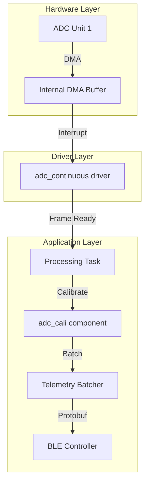

# ADC Performance & Code Design Analysis

This document evaluates the current implementation of analog signal acquisition in the ESP32-IDF project and provides a roadmap for increasing update frequency and system reliability.

## 1. Complexity Debt Report

| Category | Score | Details |
| :--- | :---: | :--- |
| **Scaling/Performance Risks** | 3 | Sequential oneshot reads, linear search calibration, per-sample BLE transmission. |
| **Architectural Leaks** | 1 | Calibration logic is tightly coupled inside the `analog_read_port` function. |
| **Observability Gaps** | 1 | No tracking of sampling jitter or BLE transmission success/latency. |
| **Safety Violations** | 1 | Unbounded loops in tasks without error-state recovery for ADC failures. |
| **Overall Rating** | **C** | **3 Scaling Risks, 1 Leak, 1 Metric Gap** |

---

## 2. Identified Bottlenecks

### A. ADC Oneshot Mode (Latency)
The current implementation in `helper_analog.cpp` uses `adc_oneshot_read()`. 
- **Problem:** This is a software-triggered, blocking call. For every sample, the CPU must manually trigger the conversion and wait for the result.
- **Impact:** Sequential reading of three channels (AN3, AN5, AN6) multiplies this latency, making high-frequency sampling ( > 500Hz) unstable and CPU-intensive.

### B. Linear Calibration Search
The `esp32_calibration()` function performs a linear `for` loop through a 33-element lookup table for *every* channel on *every* sample.
- **Problem:** $O(N)$ complexity in a high-frequency path.
- **Impact:** CPU cycles are wasted on searching instead of processing.

### C. FreeRTOS Tick Granularity
Tasks use `vTaskDelay(pdMS_TO_TICKS(period))` for timing.
- **Problem:** By default, the FreeRTOS tick is 100Hz or 1000Hz. 
- **Impact:** You cannot achieve precise sampling intervals smaller than the tick period, and scheduling jitter will introduce noise into the signal timing.

### D. BLE & Serialization Overhead
The system sends a Protobuf packet over BLE for every single reading.
- **Problem:** The BLE stack and Protobuf serialization are heavy operations.
- **Impact:** At high frequencies, the BLE MTU and internal buffers will saturate, leading to dropped packets and high latency.

---

## 3. Recommended Improvements

### Phase 1: Quick Wins (Optimization)
1. **Binary Search Calibration:** Replace the linear search with a binary search ($O(\log N)$) or use the native ESP-IDF `adc_cali` driver.
2. **Fixed-Point Arithmetic:** Avoid `float` divisions in the sampling loop; process raw `uint32_t` values and only convert to `float` at the final telemetry step.
3. **Task Priority:** Increase `analog_reading_task` priority and ensure it is pinned to Core 1 (leaving Core 0 for the BLE stack).

### Phase 2: High Performance (Refactoring)
1. **ADC Continuous Mode (DMA):**
   - Transition to `adc_continuous` driver.
   - Use DMA to fill memory buffers in the background.
   - The CPU only processes "frames" of data, drastically reducing overhead.
2. **Batch Telemetry:**
   - Instead of `BlePacket_telemetry_tag` containing one sample, modify the Protobuf definition to support a `repeated` field or a byte-array of samples.
   - Send data in batches (e.g., every 50 samples) to maximize BLE throughput.
3. **Hardware Timer Trigger:**
   - If using oneshot, trigger reads via a Hardware Timer ISR instead of a FreeRTOS task loop to eliminate jitter.

---

## 4. Implementation Reference (Target Architecture)

