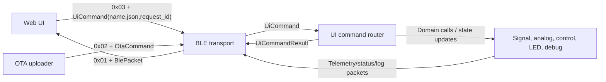

# Code Design Analysis Report

Date: 2026-04-30

Scope: ESP-IDF firmware in `main/`, shared protobuf contract in `proto/`, and the React/Web Bluetooth client in `web/src/`.

Analysis lens: module depth, responsibility boundaries, change amplification, scaling limits, observability, and safety constraints for an embedded real-time control system.

## Executive Summary

The command-routing architecture has materially improved since the first analysis. The old ASCII command router has been removed from the active BLE path, and the UI now sends namespaced protobuf `UiCommand` messages with optional JSON payloads. BLE transport is closer to a real transport boundary: it decodes frame prefixes, dispatches OTA or UI command protobufs, and sends structured protobuf responses.

The most important remaining design debt is no longer "mixed command protocols." It is domain ownership. `ble_ui_command_router.cpp` is a better command boundary, but many handlers still mutate global firmware state directly. That is acceptable for a lab project today, but it is the next place change amplification will return as more commands are added.

The project's strongest deep module is still the signal execution path: `signal_precompute_steps()` converts higher-level signal data into hardware-ready `SignalStep` records before the timing-critical loop runs. The next design pass should make configuration and validation as intentional as that execution path.

## Current System Shape

The system now divides into five major responsibilities:

1. Real-time signal generation on Core 1: `main/src/signal_controller.cpp`
2. BLE GATT transport, protobuf framing, notification sending, and OTA/UI dispatch: `main/src/ble_controller.cpp`
3. UI command registry and namespaced command handlers: `main/src/ble_ui_command_router.cpp`
4. Shared protobuf contract for telemetry, OTA, UI commands, and command results: `proto/messaging.proto`
5. Browser client connection, command encoding, telemetry decoding, and dashboard controls: `web/src/services/` and `web/src/components/Dashboard/`

The current command flow is:

## Complexity Debt Score

Overall Rating: B-

Scaling/Performance Risks: 3

- `system.list_commands` returns all registered commands in one fixed-size protobuf field; it is fine at the current command count, but it is a bounded capacity to watch.
- The signal loop disables interrupts for each full pattern cycle in `main/src/signal_controller.cpp`.
- Dataset parsing still allocates vectors and parses strings in the command path.

Architectural Leaks: 4

- `ble_ui_command_router.cpp` knows about signal globals, analog monitor state, control state, LED behavior, GPIO pins, and debug dataset formatting.
- Global state in `helper_common` remains the real integration API between modules.
- The web client still formats structured status into a text log instead of rendering a typed domain model.
- The command router filename and public header naming are slightly inconsistent: `main/src/ble_ui_command_router.cpp` includes `main/include/ui_command_router.h`.

Observability Gaps: 4

- BLE send failures are returned but many callers do not act on them.
- OTA does not enforce chunk sequence, digest, or declared transfer size in the application layer.
- Command results report success/failure, but command execution latency is not measured.
- Control corrections and saturation are not emitted as structured telemetry.

Safety Violations: 4

- `analog.set_monitor_period` rejects zero but does not enforce a practical lower bound.
- `signal.set_pattern` delegates to string parsing without making malformed patterns visible as command failures.
- `matrix_multiply_vector3()` assumes at least three columns and enough output space.
- OTA accepts declared file size and chunks without hard partition-size and digest validation in the application layer.

## What Improved

### Command routing is now a real boundary

The active UI command path is now:

- `BleManager.sendCommand(name, payload)` in `web/src/services/BleManager.ts`
- protobuf `UiCommand` in `proto/messaging.proto`
- binary BLE write prefix `0x03`
- `ble_router()` dispatch in `main/src/ble_controller.cpp`
- `ble_ui_command_dispatch()` in `main/src/ble_ui_command_router.cpp`
- protobuf `UiCommandResult` returned inside `BlePacket.command_result`

This removes the old text-command ambiguity and gives extension a clear recipe: register a namespaced command and add a handler. For a lab project, using JSON for low-frequency UI command payloads is a good tradeoff. Sensor telemetry and status remain protobuf, where binary encoding matters more.

### The UI no longer depends on ASCII command helpers

The old web-side string BLE helpers and unused menu components were removed. The service interface now writes `Uint8Array` payloads only, so accidental reintroduction of ASCII command writes is less likely.

### Command discoverability exists

`system.list_commands` returns the registered command names. This is a useful extensibility hook, especially while the firmware and UI are changing together.

### Some high-risk validation moved to the boundary

The new router rejects invalid JSON, unknown commands, `cycles == 0`, missing numeric fields, and invalid debug GPIO ports. This directly resolves the earlier division-by-zero risk from `cycles:0`.

## Main Design Risks

### 1. Command handlers still own too much domain knowledge

`ble_ui_command_router.cpp` is better than the old ASCII router, but it is still wide. It directly writes values such as `g_cycle_nrun`, `g_analog_monitor_period_ms`, `g_dead_time_cycles_up`, `g_dead_time_cycles_down`, `g_control_enabled`, and `g_system_state`.

This is the next architectural pressure point. Adding a command is easy, but adding a safe command still requires knowing which globals to mutate and which secondary updates to trigger.

Recommended direction:

- Keep the command registry in `ble_ui_command_router.cpp`.
- Move domain mutation behind narrow functions:
  - `signal_config_set_cycle_interval(uint32_t cycles)`
  - `signal_config_set_dead_time_cycles(uint32_t up_cycles, uint32_t down_cycles)`
  - `analog_config_set_monitor_period_ms(uint32_t period_ms)`
  - `control_set_enabled(bool enabled)`
- Let those functions own validation, logging, and side effects such as recomputing datasets.

### 2. `signal.set_pattern` cannot report parse failure accurately

The command router returns `"Signal pattern updated"` after calling `signal_update_from_string(pattern)`, but `signal_update_from_string()` returns `void`. If parsing fails inside the signal module, the command result can still look successful.

Recommended direction:

- Change `signal_update_from_string()` to return a small result enum or `bool`.
- Reject malformed patterns at the command boundary with a `UiCommandResult` error.
- Validate equal time/mode lengths, nonzero segment count, duration bounds, and mode bounds before touching the inactive dataset.

### 3. Safety bounds are still partial

The current router intentionally avoids heavy validation, which is reasonable for controlled lab use. Still, a few values can affect timing and should have explicit lower or upper bounds:

- `analog.set_monitor_period` should probably reject values below a documented floor such as 10 ms or 50 ms.
- `signal.set_dead_time` should have a maximum cycle value.
- `led.blink` casts `delay*_ms` to `uint16_t`, so values above `65535` wrap.
- `signal.set_alpha` accepts any float, even though the dataset table likely expects a smaller calibrated range.

Recommended direction:

- Add minimal bounds only where failure affects timing, CPU load, or hardware behavior.
- Keep validation small and local; this does not need a large schema framework.

### 4. Command discoverability is bounded by one BLE response

`system.list_commands` currently returns a compact comma-separated string inside `UiCommandResult.json`. That fits now because `UiCommandResult.json` was increased to 512 bytes. As commands grow, this response will eventually hit a fixed-size boundary.

Recommended direction:

- Keep the current simple implementation for now.
- If the command list grows, return either a count plus pages or a command namespace filter, for example `{"prefix":"signal."}`.

### 5. OTA still lacks application-level transfer guarantees

`OtaChunk.seq` and `OtaEnd.sha256` exist in the schema, but the firmware does not enforce ordering or digest validation, and the web side currently does not provide a real digest. ESP-IDF image validation helps, but the application protocol should not expose integrity fields that are not real yet.

Recommended direction:

- Track expected sequence number and reject duplicates/skips.
- Reject writes that would exceed the declared `file_size`.
- Reject `file_size == 0`.
- Compare `file_size` against the update partition size.
- Implement SHA-256 validation or remove the field until it is enforced.

## Priority Findings

### P1: OTA integrity fields are not enforced

The schema carries `seq` and `sha256`, but firmware does not validate sequence order or digest, and the web client sends an empty SHA-256. OTA should not expose fields that look like safety checks unless they are actually enforced.

References:

- `proto/messaging.proto`: `OtaChunk.seq`, `OtaEnd.sha256`
- `main/src/ota_controller.cpp`
- `web/src/services/OtaManager.ts`

### P2: Signal pattern command can report false success

`signal.set_pattern` builds a `time;mode` string, calls `signal_update_from_string()`, and returns success. Since the signal function returns `void`, parse failure cannot be propagated into `UiCommandResult`.

References:

- `main/src/ble_ui_command_router.cpp`: `handle_signal_set_pattern`
- `main/src/signal_controller.cpp`: `signal_update_from_string`

### P2: Router-to-domain coupling is still broad

The new command router solves protocol confusion, but it still reaches into several domain globals directly. This keeps command addition easy, but makes safety and side effects harder to reason about over time.

Reference:

- `main/src/ble_ui_command_router.cpp`

### P2: Telemetry period lower bound is too permissive

`analog.set_monitor_period` rejects zero, but very low nonzero values can still increase CPU/BLE pressure and distort timing experiments.

References:

- `main/src/ble_ui_command_router.cpp`: `handle_analog_set_monitor_period`
- `main/main.cpp`: analog read task delay

### P3: Command registry capacity is implicit

The command registry is a fixed array of 32 entries. That is reasonable on the ESP32, but the limit is not surfaced to the UI and `system.list_commands` is also fixed by response size.

Reference:

- `main/src/ble_ui_command_router.cpp`: `static UiCommandEntry s_commands[32]`

## High-Value Refactoring Plan

### Phase 1: Finish command result truthfulness

- Make `signal_update_from_string()` return success/failure.
- Return `invalid_argument` when `signal.set_pattern` fails.
- Add minimal bounds for monitor period, blink delays, dead-time cycles, and alpha.

### Phase 2: Move domain mutation behind narrow APIs

- Add small setter functions in the owning modules.
- Keep global variables private wherever practical.
- Preserve the current command names and JSON payloads; this phase should not require UI changes.

### Phase 3: Strengthen OTA protocol

- Enforce chunk order and total byte count.
- Validate partition size before starting.
- Implement or remove SHA-256.
- Emit clearer `OtaStatus` failures for each rejected condition.

### Phase 4: Improve typed UI status rendering

- Keep protobuf status as the source of truth.
- Store latest decoded status as structured state in the UI.
- Render status fields directly instead of rebuilding a text status block first.

## Suggested Success Criteria

For the next design pass, we should be able to say:

- Every UI command has one registered handler and one owning domain function.
- Every BLE-settable numeric value has a min, max, and unit at the command boundary or owner boundary.
- Signal pattern updates either apply completely to the inactive dataset or fail with a `UiCommandResult` error.
- OTA rejects out-of-order, oversized, or digest-mismatched transfers.
- BLE transport can be understood without knowing signal-control internals.
- `system.list_commands` continues to work as the command count grows.

## Bottom Line

The command-router refactor landed in the right direction. The system now has a clear extension path for UI commands without changing protobuf for every new command: namespaced command names plus JSON payloads inside a stable `UiCommand` envelope. That is a good lab-friendly balance.

The next architectural win is to make the command handlers thinner. BLE should frame and dispatch. The command router should name operations and parse small payloads. Signal, analog, control, LED, debug, and OTA modules should own their state changes and safety rules. That will keep the project easy to extend without letting the new router become the next mega-module.
