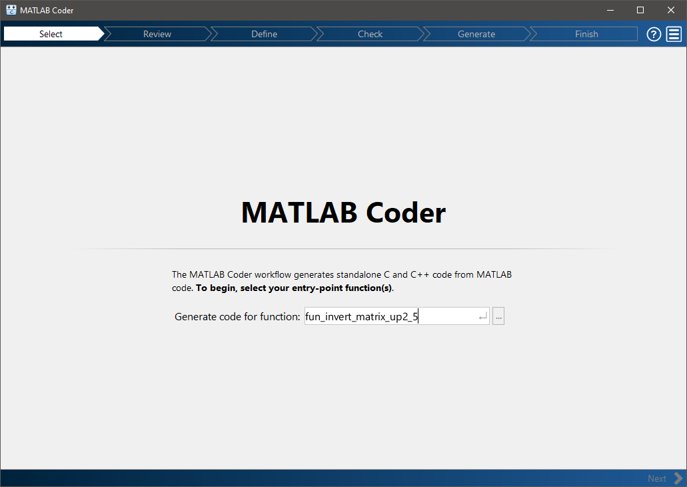

O projeto estA dividido da seguinte forma:

`fun_invert_matrix_up2_5.m` 
   
    funcao que queremos traduzir para C++. 
    Essa funcao recebe uma matrix com dimensao de atE 5x5 e retorna a sua inversa

`script_fun_invert_matrix_up2_5.m` 

    script com um exemplo de uso da funcao
    


Iniciando o MATLAB Coder:

```matlab
    >> coder
```

Esse comando deve abrir a interface grafica, nela colocamos o nome da nossa funcao:



Em seguida, escolhemos o nome do nosso projeto, serA gerado um arquivo `.prj` com esse nome com as configuracoes de geracao de codigo.


Em seguida, podemos inserir a funcao `script` com a chamada da nossa funcao a ser traduzida.

(esse passo eh opcional, podemos tambem inserir os tipos da entrada manualmente.)


Clicando em `Autodefine inpu Types`, a GUI executa o `script` e em seguida informa o resultado dos tipos


Particularmente nesse exemplo, vamos alterar os valores da dimensao de `5x5` para `:5x:5`. Isso faz com que o `code generator` entenda que a dimensao de entrada pode ser variavel.


Nesse passo podemos criar um `mexfile` em que a GUI testa se a funcao pode ser traduzida para codigo C++ e retorna um diagnostico


Agora podemos configurar nosso codigo gerado. Mudamos de `C` para `C++` e clicamos em `More Settings` para mais opcoes


Aqui vamos em `Code Appearance` e escolhemos `Generate all functions into a single file`. Isso gera menos arquivos e deixa a organizacao mais simples. (opcional)
Em seguida clicamos em `close` e entao em `Generate`


O resultado eh um diagnOstico com os arquivos gerados


Esse cOdigo fica exposto em uma pasta `codegen` na raiz do projeto


Dentro de `codegen/lib/fun_invert_matrix_up2_5` temos um arquivo `buildInfo.mat`. Abrindo ele carregamos para o `Workspace` do MATLAB as informacoes do codigo gerado.


Executamos entao o comando `packNGo` com a entrada `buildInfo` para que o MATLAB crie um arquivo `fun_invert_matrix_up2_5.zip` com todas as dependencias que precisamos para o nosso projeto:

```matlab
    >> packNGo(buildInfo)
```

Agora podemos criar um cOdigo para usar esse arquivo gerado. 

Copiar todos os arquivos `*.cpp` e `*.h` para a pasta do projeto `C++`. E entAo chamar a funcAo no cOdigo.

Um exemplo disso pode ser visto na pasta `cpp`

Nesse exemplo, um arquivo `cpp/src/main.cpp` chama a funcAo no codigo para calcular a inversa da matriz 

$$
\left[\begin{array}{ccccc} 
    3 & 2  & 4  & 4 & 5 \\
    5 & 2  & 1  & 6 & 3 \\
    9 & 3  & 2  & 1 & 9 \\
    3 & 5  & 12 & 5 & 7 \\
    9 & 14 & 2  & 1 & 5 \\
\end{array}\right]
$$

com o resultado esperado de: 

$$
\left[\begin{array}{ccccc} 
   -0.6706 &  0.2767 &  0.1641 &  0.1804 & -0.0433 \\
    0.2389 & -0.0998 & -0.0985 & -0.0712 &  0.0981 \\
   -0.4061 &  0.0947 &  0.0550 &  0.2086 & -0.0418 \\
    0.2184 &  0.0909 & -0.1026 & -0.0634 &  0.0004 \\
    0.6570 & -0.2745 & -0.0210 & -0.1959 &  0.0198 \\
\end{array}\right]
$$

E entAo resolve a inversa de:

$$
\left[\begin{array}{cc} 
    3 & 2\\
    5 & 2\\
\end{array}\right]
$$

com o resultado esperado de:

$$
\left[\begin{array}{cc} 
   -0.5000 &  0.5000 \\
    1.2500 & -0.7500 \\
\end{array}\right]
$$

Os arquivos gerados sAo inseridos em `cpp/lib`.


!!! OBS: nesse caso eh opcional, mas dentre os arquivos de `fun_invert_matrix_up2_5.zip` hA um arquivo `defines.txt`.

Nesse exemplo esse arquivo contEm:

	__USE_MINGW_ANSI_STDIO=1
	MODEL=fun_invert_matrix_up2_5

E isso foi usado no nosso arquivo `Makefile` para compilar o projeto como parametro de `DEFINE`: `-D__USE_MINGW_ANSI_STDIO=1 -DMODEL=fun_invert_matrix_up2_5`


### MINGW-64

Para compilar esse programa com esse exemplo, eh necessArio que tenha o `GNU g++` e `GNU make` instalados na maquina. (estou usando `WINDOWS` e `MINGW64` para esse exemplo). O `MINGW64` pode ser encontrado em: 

	https://sourceforge.net/projects/mingw-w64/files/mingw-w64/

Particularmente nesse exemplo estou usando o `MinGW-W64 GCC-8.1.0`, `x86_64-posix-sjlj`

Descompactei o arquivo `x86_64-8.1.0-release-posix-sjlj-rt_v6-rev0.7z` para a pasta `C:/mingw64`

Adicionei o caminho do executAvel `g++` na variAvel de ambiente do `Windows` `Path`:
		
		C:\mingw64\bin
	
E, para que o `MATLAB` tambEm encontre o `MINGW64`. Eh necessArio criar uma variAvel de ambiente `MW_MINGW64_LOC` com o valor `C:/mingw64`


